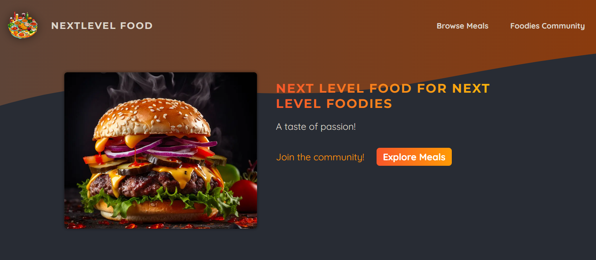
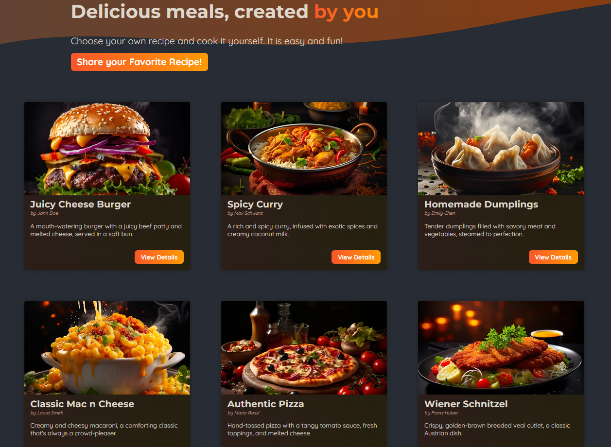
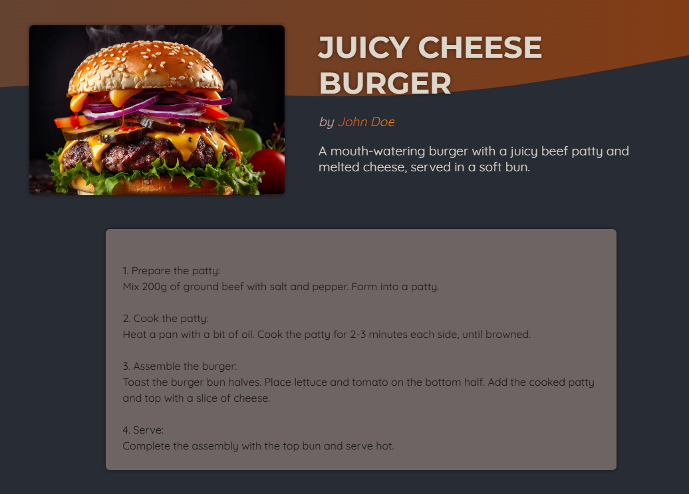
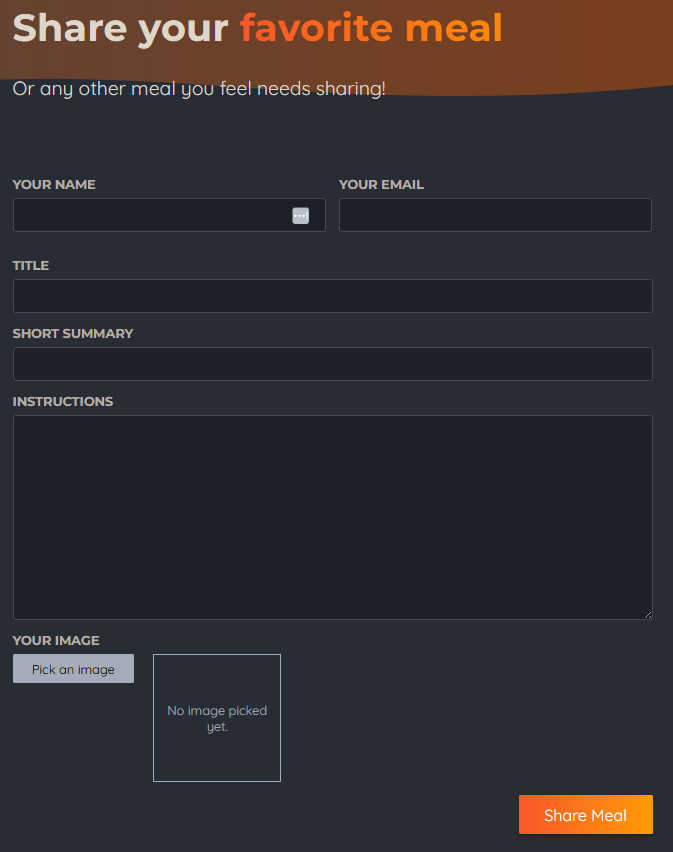

# 🍽️ Foodies - Next.js Meal Sharing App

## 📚 Overview

Foodies is a **Next.js-powered** full-stack application that allows users to **browse, share, and manage meal recipes**. The app uses **server-side rendering (SSR)**, **Next.js dynamic routing**, and an **SQLite database** to store meal information. Users can explore a variety of delicious meals, view detailed recipes, and contribute their own meals by submitting images and descriptions. The app is designed for a food-loving community to share their favorite recipes and discover new culinary inspirations.

---

## 🚀 Features

- **Next.js (App Router)** - Uses server actions and advanced routing for efficiency.
- **Server-Side Rendering (SSR)** - Fetches meal data dynamically.
- **SQLite Database** - Stores meals efficiently.
- **Dynamic Meal Pages** - Each meal has its detailed page.
- **Optimized Image Handling** - Uses Next.js `<Image>` component.
- **Error Handling & Loading States** - Custom error and loading pages.
- **Modular Components** - Structured UI with reusability.
- **Secure File Uploads** - Handles image uploads securely.
- **SEO Optimized** - Uses Next.js metadata for better indexing.

---

## 💻 Technologies Used

- **Next.js** - Full-stack React framework.
- **React 19** - Client-side rendering and component management.
- **SQLite (better-sqlite3)** - Lightweight database.
- **CSS Modules** - Scoped styling.
- **Node.js & npm** - Backend processing.
- **Slugify & XSS** - Data sanitization and security.
- **ESLint & Prettier** - Code formatting and linting.

---

## 📸 Project Preview






---

## 📂 Project Structure

```
foodies-website/
├── app/
│   ├── community/              # Community-related pages
│   ├── meals/                  # Meal-related pages
│   │   ├── [mealSlug]/         # Dynamic route for each meal
│   │   │   ├── page.js         # Renders individual meal details
│   │   │   ├── page.module.css # Scoped styles for meal details
│   │   ├── share/              # Shared meal components
│   │   ├── error.js            # Custom error page
│   │   ├── loading-out.js      # Loading animation
│   │   ├── layout.js           # Layout component for meals section
│   │   ├── not-found.js        # Custom 404 page
│   │   ├── page.js             # Main meals page
│   │   ├── page.module.css     # Meals page styling
│   ├── globals.css             # Global styles
│   ├── assets/                 # Static assets (icons, images, etc.)
│   ├── components/             # Reusable UI components
│   │   ├── main-header/        # Navigation bar/header
│   │   ├── meals/              # Meal card components
│   ├── lib/                    # Database and utility functions
│   │   ├── meals.js            # Database queries
├── public/                     # Publicly accessible assets
├── meals.db                     # SQLite database file
├── .eslintrc.json               # ESLint configuration
├── .gitignore                   # Files to ignore in Git
├── initdb.js                    # Database initialization script
├── jsconfig.json                # Path aliasing config
├── next.config.js                # Next.js configuration
├── package.json                 # Dependencies and scripts
├── package-lock.json            # Dependency lock file
└── README.md                    # Project documentation
```

---

## 💾 Installation & Setup

### 1️⃣ Clone the Repository

```sh
git clone https://github.com/Caiko/foodies-website.git
cd foodies-website
```

### 2️⃣ Install Dependencies

```sh
npm install
```

### 3️⃣ Set Up the Database

```sh
node initdb.js
```

### 4️⃣ Run the Development Server

```sh
npm run dev
```

Then open [**localhost:3000**](http://localhost:3000) in your browser.

### ⚡ Test in Production Mode!

Running the production build ensures that **Next.js optimizations**, such as **static page pre-rendering, automatic caching, and performance tuning**, take full effect. This results in **instant page loads and a more realistic user experience**, mimicking how the app will function once deployed.

### 5️⃣ Build for Production

```sh
npm run build
```

This command compiles the application for production, optimizing performance and generating static pages where possible.

### 6️⃣ Run in Production Mode

```sh
npm start
```

This starts the optimized **production server**, which is different from the development server and ensures better performance.

---

## 🗒️ Features Breakdown

### **1. **``** Component in Next.js**

- **Improved Performance:** Automatically optimizes images.
- **Lazy Loading:** Reduces initial load time.
- **Responsive Behavior:** Adapts to screen sizes.
- **CDN Support:** Uses Next.js built-in optimization.

```jsx
<Image src={image} alt={title} fill />
```

### **2. Slideshow Component**

- Uses `useEffect()` to automatically transition images.
- Ensures smooth user experience.
- Cleans up `setInterval()` to avoid memory leaks.

```jsx
useEffect(() => {
  const interval = setInterval(() => {
    setCurrentImageIndex((prevIndex) =>
      prevIndex < images.length - 1 ? prevIndex + 1 : 0
    );
  }, 5000);
  return () => clearInterval(interval);
}, []);
```

### **3. Dynamic Routing with **``

- Highlights active navigation tabs dynamically.
- Uses a dedicated `NavLink` component for efficient updates.

```jsx
const path = usePathname();
<Link
  href="/meals"
  className={path.startsWith("/meals") ? classes.active : undefined}
>
  Browse Meals
</Link>;
```

### **4. Secure Form Submission & Data Validation**

- Uses `useActionState()` to manage form submission.
- Implements `slugify` for URL-safe slugs.
- Sanitizes inputs with `xss` to prevent XSS attacks.

```jsx
const [state, formAction] = useActionState(shareMeal, { message: null });
<form action={formAction}> ... </form>;
```
